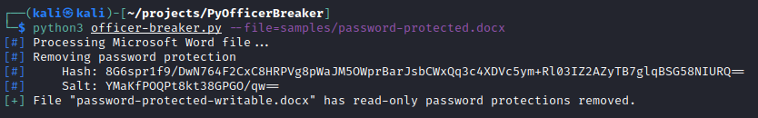
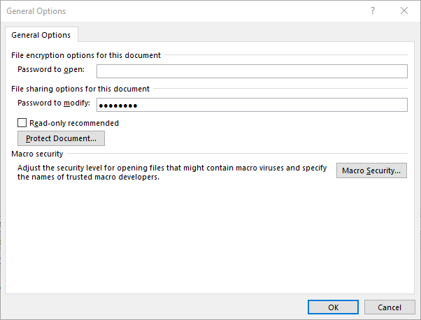
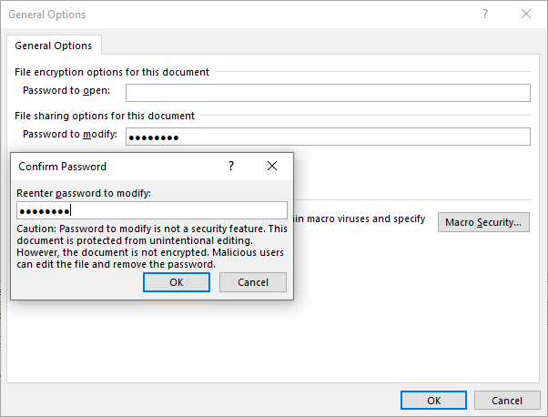

# Py Officer Breaker

Py Officer Breaker removes the password from a read-only protected Office Open XML file. This does **not** remove the password of a fully encrypted Office document.

Python3 implementation of [OfficerBreaker](https://github.com/nedlir/OfficerBreaker). See that repository for additional information on how the password is removed from the document.

## Usage

```
usage: officer-breaker.py [-h] --file FILE [--out OUT]

Officer Breaker removes a read-only password restriction from a docx/pptx/xlsx file.

optional arguments:
  -h, --help   show this help message and exit
  --file FILE  The target docx/pptx/xlsx file.
  --out OUT    The output filename to be created. Default is {file}-writable.{extension}
```



## Supported File Formats
| Name                 | Extension | Path  | XML File         | XML Elements                        |
|:-------------------- |:--------- |:----- |:---------------- |:----------------------------------- |
| Microsoft Word       | docx      | word/ | settings.xml     | writeProtection, documentProtection |
| Microsoft Powerpoint | pptx      | ppt/  | presentation.xml | modifyVerifier                      |
| Microsoft Excel      | xlsx      | xl/   | workbook.xml     | fileSharing, workbookProtection     |

## Creating an Office document with a read-only password protection
1. Create a document, then click "Save As"  
2. Click the "Tools" dropdown and select "General"  

3. Enter a password in the "Password to modify" field, then click "OK"  

4. Reenter selected password, then click "OK"  
